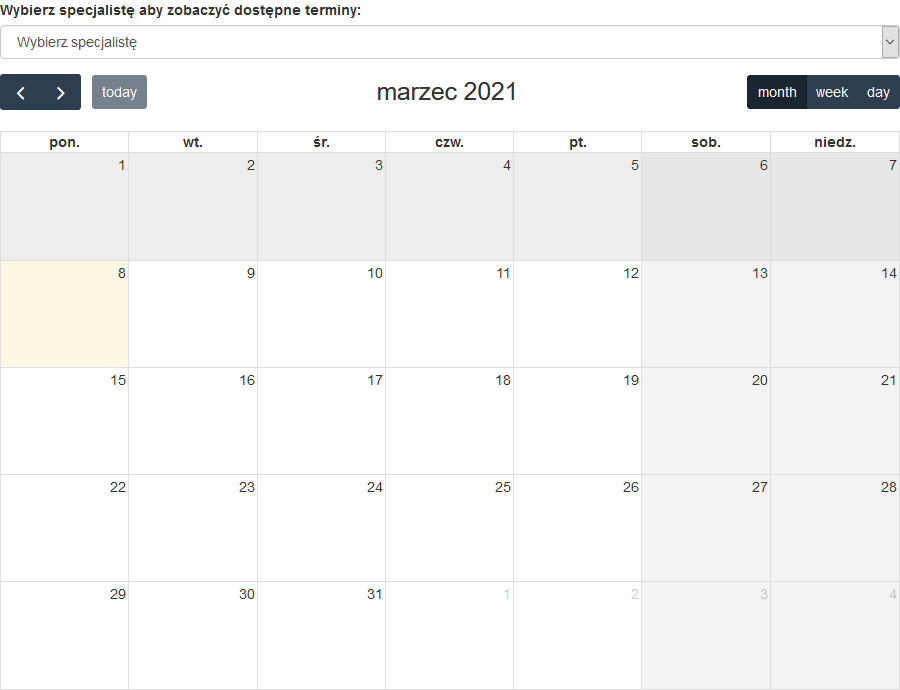

<!-- TABLE OF CONTENTS -->

  
Table of Contents

  <ol>
    <li>
      <a href="#about-the-project">About The Project</a>
      <ul>
        <li><a href="#built-with">Built With</a></li>
      </ul>
    </li>
    <li><a href="#usage">Usage</a></li>
    <li><a href="#contact">Contact</a></li>
  </ol>

<!-- ABOUT THE PROJECT -->
## About The Project

<a href="https://kalendarz.biznesport.com.pl">LiveDemo</a>

...

### Built With
* [Bootstrap 3.4.1](https://getbootstrap.com)
* [JQuery 3.5.1](https://jquery.com)
* [Symfony 5.2](https://symfony.com)
* [FullCalendar 4.4.2](https://fullcalendar.io)

<!-- USAGE EXAMPLES -->
## Usage

Use this space to show useful examples of how a project can be used. Additional screenshots, code examples and demos work well in this space. You may also link to more resources.

_For more examples, please refer to the [Documentation](https://example.com)_

<!-- CONTACT -->
## Contact
[LinkedIn](https://www.linkedin.com/in/danielszczerbinski)  
[Email](mailto:danielszczerbinskii@gmail.com)

Project Link: [https://github.com/dszczerbinski/Calendar](https://github.com/dszczerbinski/Calendar)
