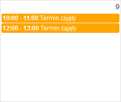

<h3 align="center">Calendar</h3>

FullCalendar integrated with PayU and Google Calendar API

<!-- TABLE OF CONTENTS -->

  
Table of Contents

  <ol>
    <li>
      <a href="#about-the-project">About The Project</a>
      <ul>
        <li><a href="#demo">Demo</a></li>
        <li><a href="#built-with">Built With</a></li>
      </ul>
    </li>
     <li>
      <a href="#site">Site</a>
      <ul>
        <li><a href="#main-page">Main Page</a></li>
        <li><a href="#events">Events</a></li>
        <li><a href="#register-form">Register form</a></li>
      </ul>
    </li>
    <!-- <li><a href="#usage">Usage</a></li> -->
    <li><a href="#contact">Contact</a></li>
  </ol>

<!-- ABOUT THE PROJECT -->
## About The Project

A calendar using PayU and Google Calendar API to display and creating events. Its a website module to booking terms to specialist like psychoterapist. All events are connected and sync with host Google Calendar

### Demo
Here is a working live demo: [https://kalendarz.biznesport.com.pl](https://kalendarz.biznesport.com.pl)

### Built With
* [Bootstrap 3.4.1](https://getbootstrap.com)
* [JQuery 3.5.1](https://jquery.com)
* [Symfony 5.2](https://symfony.com)
* [FullCalendar 4.4.2](https://fullcalendar.io)

<!-- SITE -->
## Site
### Main Page

### Events
Events shows after chose specialist from dropdown menu  

### Register form

<!-- USAGE EXAMPLES 
## Usage

... -->

<!-- CONTACT -->
## Contact
[LinkedIn](https://www.linkedin.com/in/danielszczerbinski)  
[Email](mailto:danielszczerbinskii@gmail.com)

Project Link: [https://github.com/dszczerbinski/Calendar](https://github.com/dszczerbinski/Calendar)
